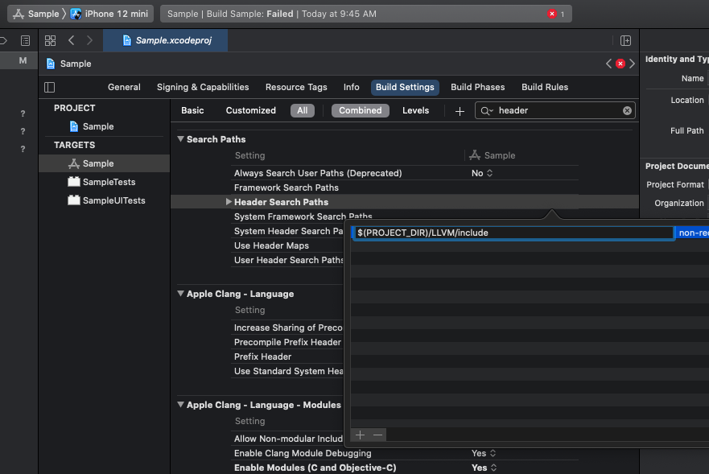
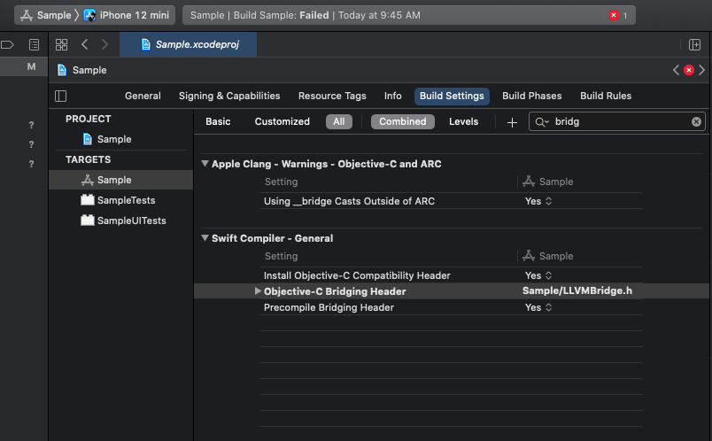

LLVM on iOS
===========

Build LLVM for iOS (physical device and simulator)
--------------------------------------------------

From [the official instructions](https://llvm.org/docs/GettingStarted.html):

```shell
    git clone https://github.com/llvm/llvm-project.git # Alternatively, download and extract the monorepo source code from https://releases.llvm.org/download.html
    cd llvm-project
    mkdir build
    cd build
    cmake -G <generator> [options] ../llvm
```

Our script [buildllvm-iOS.sh](buildllvm-iOS.sh) and [buildllvm-iOS-Simulator.sh](buildllvm-iOS-Simulator.sh) build LLVM, Clang and LLD for iOS and iOS simulator respectively. We disable various stuffs such as `terminfo` since there is no terminal in iOS; otherwise, there will be problem when linking in Xcode. Needs:
 * [CMake](https://cmake.org/download/): See [installation instruction](https://tudat.tudelft.nl/installation/setupDevMacOs.html) to add to PATH.
 * [Ninja](https://github.com/ninja-build/ninja/releases): Download and extract the ninja executable to `~/Downloads` folder.

Once the tools are ready, run the script in the `llvm-project` top folder (or `llvm-project-VERSION` if you download the source zipped package instead of cloning).
Once the build process is completed, the library and include headers should be available at `~/Download/LLVM-iOS` or `~/Download/LLVM-iOS-Simulator`.

Usage in iOS App
----------------

1. Before being able to use in Xcode, in the built folder, we first need to move the `lib/clang/` and `lib/cmake` and `lib/*.dylib` out of `lib/`:
```shell
    cd ~/Download/LLVM-iOS
    mkdir lib2
    mv lib/clang lib2/
    mv lib/cmake lib2/
    mv lib/*.dylib lib2/
```
Otherwise, iOS will crash when loading dynamic libraries.

2. Create a new iOS app project in Xcode, say `Sample` and copy the built folder, say `~/Download/LLVM-iOS-Simulator`, to the root folder of your project:
```shell
    cp ~/Download/LLVM-iOS-Simulator LLVM  # Assuming at Sample project folder
```
We shall assume the target folder is `LLVM`. Note that you must copy the `LLVM-iOS-Simulator` when running on simulator.

3. Add the LLVM static libraries to your project by right click on the Sample project, choose **Add files to "YOUR PROJECT NAME"** and select the **LLVM/lib** folder.
Enable **Create groups** but not **Copy items if needed**.

4. Next, we add `LLVM/include` to header search path.
Go to **Build settings** your project, click on **All** and search for `header`.
You should find **Header Search Paths** under **Search Paths**.
Add a new item `$(PROJECT_DIR)/LLVM/include`.



5. Finally, you probably want to write your app in Swift but LLVM library is written in C++ so we need to create a bridge to expose LLVM backend to your app Swift frontend.
This is accomplished via Objective-C i.e. Swift -> Objective-C -> C++.
Add to your project a new header file, say `LLVMBridge.h` and the implementation Objective-C++ file, say `LLVMBridge.mm`.
We set Objective-C bridging header to expose the Objective-C (and hence, C++) code to Swift.
Go to **Build settings** your project and search for `bridg` and you should find **Objective-C Bridging Header** under **Swift Compiler - General**.
Set it to `Sample/LLVMBridge.h` or a header file of your choice (but that header should include `LLVMBridge.h`).



Now you are ready to make use of LLVM glory.

Our Sample iOS Project
----------------------

We provide a sample iOS app project in the [Sample/](Sample) folder; no license attached so feel free to do whatever you want with it.
In this project, we use Clang's C interpreter example located in `examples/clang-interpreter/main.cpp` of Clang source code to interpret a simple C++ program.
The code is pretty much copied verbatim except for a minor modification, namely: We change the `main` function name to `clangInterpret` since iOS app already has `main` function.
At this point, you can only see the program's [standard] output in Xcode output panel.
We will attempt to redirect the output to the app UI in the future.
