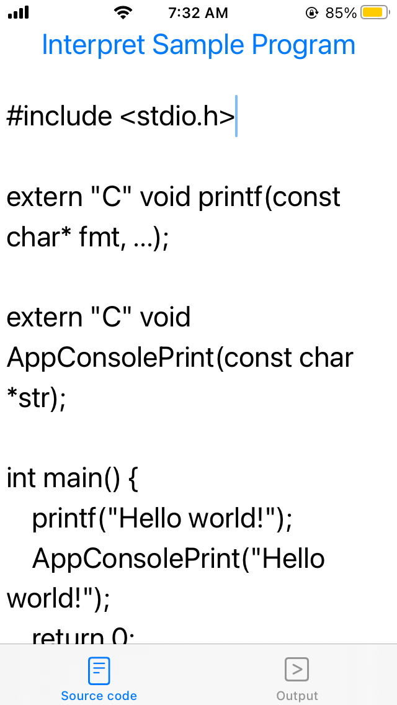

LLVM on iOS
===========

The goal of this project is to illustrate how to use LLVM + Clang on iOS.

For the eager reader, we provide a sample iOS app project in the [Sample/](Sample) folder which has **NO license attached** so feel free to do whatever you want with it.
In this app, we use Clang's C interpreter example located in `examples/clang-interpreter/main.cpp` of Clang source code to _interpret a simple C++ program_ and _print out the output on the iOS app's user interface_.
(The file was renamed to `Interpreter.cpp` to fit in with iOS development style.)
The code is pretty much copied verbatim except for some minor modifications, namely:

1. We change the `main` function name to `clangInterpret` since iOS app already has `main` function.

2. We comment out the last line
```c++
// llvm::llvm_shutdown();
```
so that you can _call `clangInterpret` again_ in the app.
This line only makes sense in the original program because it was a one-shot command line program.

3. We add a third parameter
```c++
llvm::raw_ostream &errorOutputStream
```
to `clangInterpret` and replace all `llvm::errs()` with `errorOutputStream` so we can capture the compilation output and pass it back to the app front-end to display to the user.

4. **For real iOS device**: The implementation of [`llvm::sys::getProcessTriple()`](https://github.com/llvm/llvm-project/blob/master/llvm/lib/Support/Host.cpp) is currently bogus according to the implementation of [`JITTargetMachineBuilder::detectHost()`](https://github.com/llvm/llvm-project/blob/master/llvm/lib/ExecutionEngine/Orc/JITTargetMachineBuilder.cpp).
So we need to add the appropriate conditional compilation directive `#if TARGET_OS_SIMULATOR ... #else ... #endif` to give it the correct triple. (The platform macro is documented at `<TargetConditionals.h>`.)

In the latest version, you should be able to edit the program, interpret it and see the output in the app UI.

### Preparations

Before building the project, you need to either
1. compile LLVM (see instructions down); or
2. download and extract a prebuilt binary package from our [releases](https://github.com/light-tech/LLVM-On-iOS/releases)
and copy the LLVM installation folder, say `~/Download/LLVM-iOS-Simulator`, to the root folder of the project like this
```shell
# At Sample project folder:
cp ~/Download/LLVM-iOS-Simulator LLVM
```

Here, let us download `LLVM11-iOS-Sim.tar.xz`, extract it and copy the `LLVM-iOS-Simulator` to build the app and run it on the simulator:


### Known Limitations

For simulator, can only build **Debug** version only!

Do NOT expect the app to work on real iPhone due to iOS security preventing [Just-In-Time (JIT) Execution](https://saagarjha.com/blog/2020/02/23/jailed-just-in-time-compilation-on-ios/) that the interpreter example was doing.
By pulling out the device crash logs, the reason turns out to be the fact the [code generated in-memory by LLVM/Clang wasn't signed](http://iphonedevwiki.net/index.php/Code_Signing) and so the app was terminated with SIGTERM CODESIGN.

If there is compilation error, the error message was printed out instead of crashing as expected:




**Note**: It does work if one [launches the app from Xcode](https://9to5mac.com/2020/11/06/ios-14-2-brings-jit-compilation-support-which-enables-emulation-apps-at-full-performance/) though.

To make the app work on real iPhone _untethered from Xcode_, one possibility is to use compilation into binary, somehow sign it and use [system()](https://stackoverflow.com/questions/32439095/how-to-execute-a-command-line-in-iphone).
Another possibility would be to use the slower LLVM bytecode interpreter instead of ORC JIT that the example was doing, as many [existing terminal apps](https://opensource.com/article/20/9/run-linux-ios) illustrated.

Build LLVM for iOS (physical device and simulator)
--------------------------------------------------

### The tools we needs

 * [Xcode](https://developer.apple.com/xcode/): Download from app store.
 * [CMake](https://cmake.org/download/): See [installation instruction](https://tudat.tudelft.nl/installation/setupDevMacOs.html) to add to PATH.
 * [Ninja](https://github.com/ninja-build/ninja/releases): Download and extract the ninja executable to `~/Downloads` folder.
 * Optionally, `autoconf` is needed to build libffi, install it with homebrew from the terminal
```shell
brew install autoconf
```

### Build libffi

To use the non-JIT interpreter, we want to build LLVM with [libffi](https://github.com/libffi/libffi). Grab the project with
```shell
git clone https://github.com/libffi/libffi.git
```
and open the provided Xcode project file `libffi.xcodeproj`.

Go to **Product > Scheme > libffi-iOS** to target iOS (instead of tvOS by default) and then optionally to **Product > Scheme > Edit Scheme** and set *Build Configuration* to *Release* instead of *Debug*.

Now choose the targets (iOS simulator, iOS device) and build the project.

If there is no compilation error, in the main project navigation panel, you should see the **libffi.a** under **Products** folder turns from red (before build) to white (after build).
Right click on it and choose *Show in Finder*.

Go to the parent folder and you should see `Release-iphoneos` and `Release-iphonesimulator` that contains the libffi include headers and library.
Copy those folders to `~/Download/libffi`.

Our LLVM built script assumes these.

### Build LLVM and co.

Our script [buildllvm-iOS.sh](buildllvm-iOS.sh) and [buildllvm-iOS-Simulator.sh](buildllvm-iOS-Simulator.sh) build LLVM, Clang, LLD and LibC++ for iOS and iOS simulator respectively.
We disable various stuffs such as `terminfo` since there is no terminal in iOS; otherwise, there will be problem when linking in Xcode.
Feel free to adjust to suit your need according to [the official instructions](https://llvm.org/docs/GettingStarted.html).

Run the script in the `llvm-project` top folder (or `llvm-project-VERSION` if you download the source zipped package instead of cloning).

**Note**: When building for real iOS device, you need to open `build_ios/CMakeCache.txt` at this point
```shell
cd build_ios
vim CMakeCache.txt
```
and search for and change the value of **HAVE_FFI_CALL** to **1**.
For some reason, CMake did not manage to determine that `ffi_call` was available even though it really is the case.
After that, build and install with
```shell
cmake --build .
cmake --install .
```

Grab a coffee as it will take roughly 30 mins to complete.

Once the build process is completed, the library and include headers should be installed at `~/Download/LLVM-iOS` or `~/Download/LLVM-iOS-Simulator`.
(We will subsequently refer to these directories as the _LLVM installation dir_.)

### Post compilation and installation

Before being able to use in Xcode, in the built folder, we first need to move the `lib/clang/` and `lib/cmake` and `lib/*.dylib` out of `lib/`:
```shell
cd ~/Download/LLVM-iOS
mkdir lib2
mv lib/clang lib2/
mv lib/cmake lib2/
mv lib/*.dylib lib2/
```
Otherwise, iOS will crash when loading dynamic libraries.
Running our script [prepare-llvm.sh](prepare-llvm.sh) in the LLVM installation dir will perform the necessary set-up.

Optionally, you could move the `liblld*` to `lib2` as well and the `bin` since it's unlikely you need binary linkage and the `clang` command line program in iOS app.

The ready-to-use archive on our release page was created with
```shell
tar -cJf LLVM11-iOS.tar.xz LLVM-iOS/
tar -cJf LLVM11-iOS-Sim.tar.xz LLVM-iOS-Sim/
```

Behind the Scene
----------------

These days, you probably want to write your app in _Swift_ whereas LLVM library is written in _C++_ so we need to create a _bridge_ to expose LLVM backend to your app Swift frontend. This could be accomplished via Objective-C as an intermediate language:
```
Swift <-> Objective-C <-> C++
```
So to understand how our Sample project works, you need to know
1. how language interoperability works; and
2. how to configure your Xcode project to use it.

### Swift-C++ interoperability

To start, you might want to start with _Anthony Nguyen_'s 
[Using C++ in Objective-C iOS app: My first walk](https://medium.com/@nguyenminhphuc/using-c-in-objective-c-ios-app-my-first-walk-77319d94a940)
for a quick intro on how to make use of C++ in Objective-C.
(Note that both C++ and Objective-C are extensions of C and reduces to C.)
An easy read on Objective-C and Swift interoperability could be found in
[Understanding Objective-C and Swift interoperability](https://rderik.com/blog/understanding-objective-c-and-swift-interoperability/#expose-swift-code-to-objective-c)
by _RDerik_.
Combining these two articles is the basis for our Sample app.

A typical approach to allow C++ in Swift-based iOS app will be using
 * _Swift_       : Anything iOS-related (UI, file system access, Internet, ...)
 * _Objective-C_ : Simple classes (like [`LLVMBridge`](Sample/Sample/LLVMBridge.h) in our Sample app) to expose service written in C++.
                   The main role is to convert data types between C++ and Swift.
                   For example: Swift's `Data` to Objective-C's `NSData` to C++'s buffer `char*` (and length).
 * _C++_         : Actual implementation of processing functionality.

**Tip**: When writing bridging classes, you should use `NSData` for arguments instead of `NSString` and leave the `String <-> Data` conversion to Swift since you will want a `char*` in C++ anyway.

_Apple_'s [Programming with Objective-C](https://developer.apple.com/library/archive/documentation/Cocoa/Conceptual/ProgrammingWithObjectiveC/Introduction/Introduction.html#//apple_ref/doc/uid/TP40011210)
is fairly useful in helping us write the Objective-C bridging class `LLVMBridge`: Once we pass to C++, we are in our home turf.

### Configure iOS App Xcode Project

1. Create a new iOS app project in Xcode and copy an LLVM installation to the project folder.
Unfortunately, LLVM cannot build fat binary for iOS at the moment so we have to manually switch between the two LLVM installations when we switch testing between real iOS device (ARM) or iOS simulator (x86_64).
A good approach is to copy both folders `~/Download/LLVM-iOS` or `~/Download/LLVM-iOS-Simulator` to the project folder and rename one of them to `LLVM` depending on our build target.

2. Add the LLVM static libraries to your project by right click on the Sample project, choose **Add files to "YOUR PROJECT NAME"** and select the **LLVM/lib** folder.
Enable **Create groups** but not **Copy items if needed**.

3. Next, we add `LLVM/include` to header search path so that our C++/Objective-C++ code can `#include` the LLVM's headers.
Go to **Build settings** your project, click on **All** and search for `header`.
You should find **Header Search Paths** under **Search Paths**.
Add a new item `$(PROJECT_DIR)/LLVM/include`.


4. To create the Objective-C bridge between Swift and C++ mentioned at the beginning, add to your project a new header file, say `LLVMBridge.h` and an implementation file, say `LLVMBridge.mm` (here, we use the `.mm` extension for Objective-C++ since we do need C++ to implement our `LLVMBridge` class) and then change the Objective-C bridging header setting in the project file to tell Xcode that the Objective-C class defined in `LLVMBridge.h` should be exposed to Swift.
Again, go to **Build settings** your project and search for `bridg` and you should find **Objective-C Bridging Header** under **Swift Compiler - General**.
Set it to `PROJECT_NAME/LLVMBridge.h` or if you are using more than just LLVM, a header file of your choice (but that header should include `LLVMBridge.h`).

**Note**: Only Objective-C classes in *Objective-C Bridging Header* are visible to Swift!


At this point, we should be able to run the project on iOS simulator.
**To build the app for real iOS devices, an extra step is needed.**

5. Since we are using a bunch of precompiled static libraries (and not the actual C++ source code in our app), we need to disable bitcode. Search for `bitcod` and set **Enable Bitcode** setting to `No`.


Now you are ready to make use of LLVM glory.
