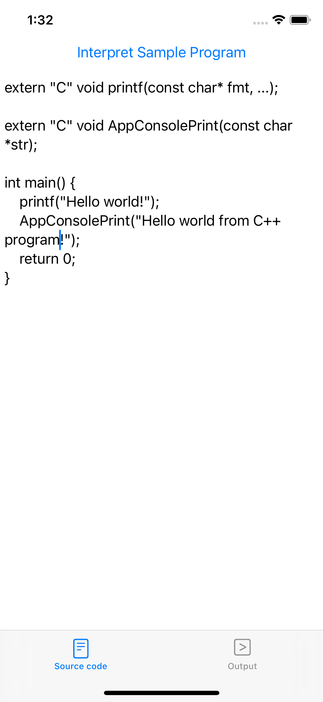
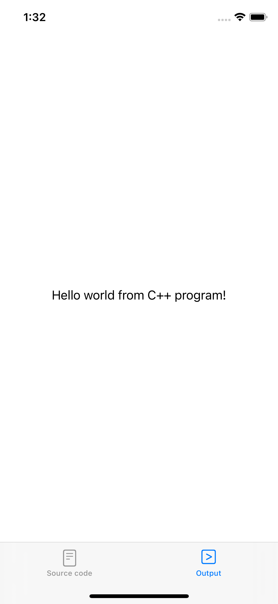
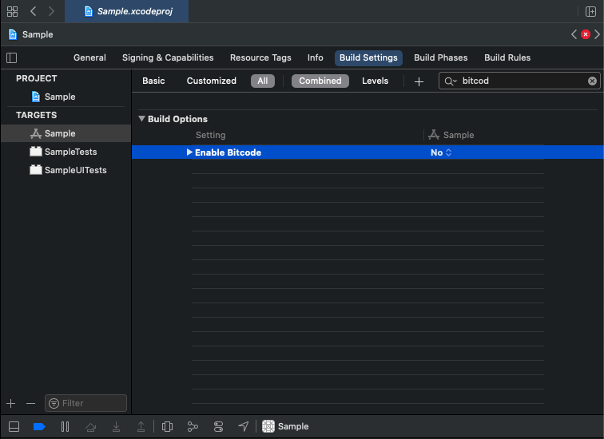

LLVM on iOS
===========

The goal of this project is to illustrate how to use LLVM + Clang to provide an iOS app with some scripting capability.




For the eager reader, we provide a sample iOS app project which has **NO license attached** so feel free to do whatever you want with it.
In this app, we use Clang's C interpreter example located in `examples/clang-interpreter/main.cpp` of Clang source code to _interpret a simple C++ program_ and _print out the output on the iOS app's user interface_.
(The file was renamed to `Interpreter.cpp` to fit in with iOS development style.)
The code is pretty much copied verbatim except for some minor modifications, namely:

1. We change the `main` function name to `clangInterpret` since iOS app already has `main` function.

2. We comment out the last line
```c++
// llvm::llvm_shutdown();
```
so that you can _call `clangInterpret` again_ in the app.
This line only makes sense in the original program because it was a one-shot command line program.

3. We add a third parameter
```c++
llvm::raw_ostream &errorOutputStream
```
to `clangInterpret` and replace all `llvm::errs()` with `errorOutputStream` so we can capture the compilation output and pass it back to the app front-end to display to the user.

4. **For real iOS device**: The implementation of [`llvm::sys::getProcessTriple()`](https://github.com/llvm/llvm-project/blob/main/llvm/lib/Support/Host.cpp) is currently bogus according to the implementation of [`JITTargetMachineBuilder::detectHost()`](https://github.com/llvm/llvm-project/blob/main/llvm/lib/ExecutionEngine/Orc/JITTargetMachineBuilder.cpp).
So we need to add the appropriate conditional compilation directive `#ifdef __aarch64__ ... #else ... #endif` to give it the correct triple.

In the latest version, you should be able to edit the program, interpret it and see the output in the app UI.

### Preparations

Before building the project, you need to either
1. compile LLVM (see instructions down below); or
2. download our prebuilt XCFramework (the file named `LLVM.xcframework.tar.xz`) from our [releases](https://github.com/light-tech/LLVM-On-iOS/releases),
then `cd` to the repo folder and do
```shell
tar -xzf PATH_TO_DOWNLOADED_TAR_XZ             # e.g. ~/Downloads/LLVM.xcframework.tar.xz
```

### Known Limitations

For simulator, can only build **Debug** version only!

You can run the app on the Mac (thank to Mac Catalyst) and iOS simulator. Do NOT expect the app to work on real iPhone due to iOS security preventing [Just-In-Time (JIT) Execution](https://saagarjha.com/blog/2020/02/23/jailed-just-in-time-compilation-on-ios/) that the interpreter example was doing.
By pulling out the device crash logs, the reason turns out to be the fact the [code generated in-memory by LLVM/Clang wasn't signed](http://iphonedevwiki.net/index.php/Code_Signing) and so the app was terminated with SIGTERM CODESIGN.

If there is compilation error, the error message was printed out instead of crashing as expected:


**Note**: It does work if one [launches the app from Xcode](https://9to5mac.com/2020/11/06/ios-14-2-brings-jit-compilation-support-which-enables-emulation-apps-at-full-performance/) though.

To make the app work on real iPhone _untethered from Xcode_, one possibility is to use compilation into binary, somehow sign it and use [system()](https://stackoverflow.com/questions/32439095/how-to-execute-a-command-line-in-iphone).
Another possibility would be to use the slower LLVM bytecode interpreter instead of ORC JIT that the example was doing, as many [existing terminal apps](https://opensource.com/article/20/9/run-linux-ios) illustrated.

Build LLVM for iOS
------------------

### The tools we needs

 * [Xcode](https://developer.apple.com/xcode/): Download from app store.
    - Note that we need the Xcode command line tools as well.
 * The common GNU tool [wget](https://www.gnu.org/software/wget/) (Optional): Unfortunately, pristine Mac installation does not come with this command line tool. You could
    - [Compile it from source](https://osxdaily.com/2012/05/22/install-wget-mac-os-x/)
    - Use Homebrew
    - Skip this tool altogether and download the [LLVM source](https://github.com/llvm/llvm-project/releases/) yourself using a browser. (You need to get a file of the form `llvm-project-VERSION.src.tar.xz` that is about 100MB in size. Put it at this repo root.)
 * [CMake](https://cmake.org/download/): See [installation instruction](https://tudat.tudelft.nl/installation/setupDevMacOs.html) to add to `$PATH`.
 * [Ninja](https://ninja-build.org/): Download the [binary](https://github.com/ninja-build/ninja/releases) and add it to `$PATH`.
 * Various GNU build tools [autoconf](https://www.gnu.org/software/autoconf/), [automake](https://www.gnu.org/software/automake/) and [libtool](https://www.gnu.org/software/libtool/): You can use our script `build-tools.sh` to create a local copy for building LLVM.

Except for Xcode, the other items can be easily installed with Homebrew:
```shell
brew install wget cmake ninja autoconf automake libtool
```

_WARNING_: It has come to our attention that LLVM's CMake Build configuration have some dependency discovery that might be interfered by Homebrew. For example, LLVM depends on `libz` that is both supplied by Xcode and Homebrew. Since we are building for iOS, we really want the Xcode version of the library. But CMake can discover the Homebrew version and uses it instead! So you might want to build on a pristine machine. Don't get yourself **Homescrewed**<sup>TM</sup>!

### Build LLVM and co.

Apple has introduced [XCFramework](https://developer.apple.com/videos/play/wwdc2019/416/) to allow packaging a library for multiple-platforms (iOS, Simulator, watchOS, macOS) and CPU architectures (x86_64, arm64) that could be easily added to a project.

Our script [build-llvm-framework.sh](build-llvm-framework.sh) builds LLVM for several iOS platforms and packages it as an XCFramework so we do not have to switch out the libraries when we build the app for different targets (e.g. testing the app on real iPhone arm64 vs simulator x86_64). The script assumes the various tools aforementioned are installed and asccessible in `$PATH`.

At this repo root:
```shell
./build-llvm-framework.sh iphoneos iphonesimulator maccatalyst
```

We can now build the library on an [Azure DevOps](https://lightech.visualstudio.com/LLVM/_build) pipeline.

Behind the Scene
----------------

These days, you probably want to write your app in _Swift_ whereas LLVM library is written in _C++_ so we need to create a _bridge_ to expose LLVM backend to your app Swift frontend. This could be accomplished via Objective-C as an intermediate language:
```
Swift <-> Objective-C <-> C++
```
So to understand how our Sample project works, you need to know
1. how language interoperability works; and
2. how to configure your Xcode project to use it.

### Swift-C++ interoperability

To start, you might want to start with _Anthony Nguyen_'s 
[Using C++ in Objective-C iOS app: My first walk](https://medium.com/@nguyenminhphuc/using-c-in-objective-c-ios-app-my-first-walk-77319d94a940)
for a quick intro on how to make use of C++ in Objective-C.
(Note that both C++ and Objective-C are extensions of C and reduces to C.)
An easy read on Objective-C and Swift interoperability could be found in
[Understanding Objective-C and Swift interoperability](https://rderik.com/blog/understanding-objective-c-and-swift-interoperability/#expose-swift-code-to-objective-c)
by _RDerik_.
Combining these two articles is the basis for our Sample app.

A typical approach to allow C++ in Swift-based iOS app will be using
 * _Swift_       : Anything iOS-related (UI, file system access, Internet, ...)
 * _Objective-C_ : Simple classes (like [`LLVMBridge`](Sample/Sample/LLVMBridge.h) in our Sample app) to expose service written in C++.
                   The main role is to convert data types between C++ and Swift.
                   For example: Swift's `Data` to Objective-C's `NSData` to C++'s buffer `char*` (and length).
 * _C++_         : Actual implementation of processing functionality.

**Tip**: When writing bridging classes, you should use `NSData` for arguments instead of `NSString` and leave the `String <-> Data` conversion to Swift since you will want a `char*` in C++ anyway.

_Apple_'s [Programming with Objective-C](https://developer.apple.com/library/archive/documentation/Cocoa/Conceptual/ProgrammingWithObjectiveC/Introduction/Introduction.html#//apple_ref/doc/uid/TP40011210)
is fairly useful in helping us write the Objective-C bridging class `LLVMBridge`: Once we pass to C++, we are in our home turf.

### Configure iOS App Xcode Project

1. Create a new iOS app project in Xcode and copy `LLVM.xcframework` to the project folder.

2. In Xcode, add `LLVM.xcframework` to the project's Framework and Libraries. Choose **Do not embed** so that the static library is linked into the app and the entire framework is NOT copied to the app bundle.

3. To create the Objective-C bridge between Swift and C++ mentioned at the beginning, add to your project a new header file, say `LLVMBridge.h` and an implementation file, say `LLVMBridge.mm` (here, we use the `.mm` extension for Objective-C++ since we do need C++ to implement our `LLVMBridge` class) and then change the Objective-C bridging header setting in the project file to tell Xcode that the Objective-C class defined in `LLVMBridge.h` should be exposed to Swift.
Again, go to **Build settings** your project and search for `bridg` and you should find **Objective-C Bridging Header** under **Swift Compiler - General**.
Set it to `PROJECT_NAME/LLVMBridge.h` or if you are using more than just LLVM, a header file of your choice (but that header should include `LLVMBridge.h`).

**Note**: Only Objective-C classes in *Objective-C Bridging Header* are visible to Swift!


At this point, we should be able to run the project on iOS simulator.
**To build the app for real iOS devices, an extra step is needed.**

4. Since we are using a bunch of precompiled static libraries (and not the actual C++ source code in our app), we need to disable bitcode. Search for `bitcod` and set **Enable Bitcode** setting to `No`.



Now you are ready to make use of LLVM glory.
